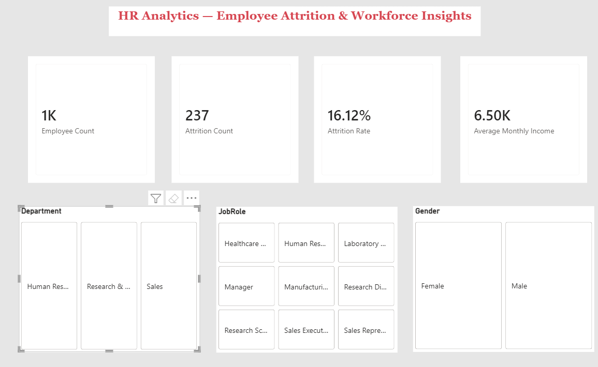
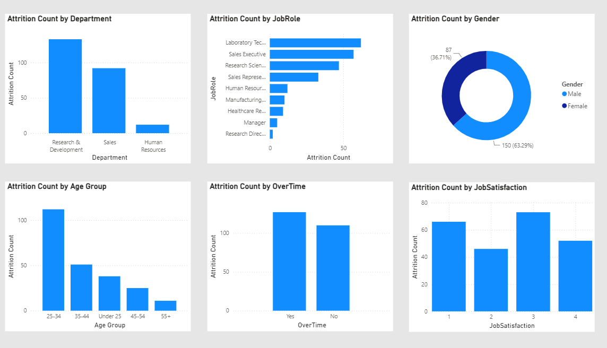
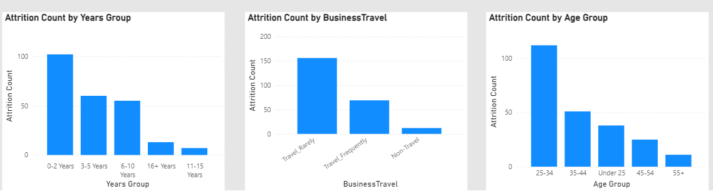

# HR-Analytics-Employee-Attrition-PowerBI
Interactive Power BI HR Analytics dashboard analyzing employee attrition, workforce trends, and key factors influencing employee turnover using Power Query and DAX.

## 📊 Project Overview

An interactive **HR Analytics Dashboard built with Microsoft Power BI** to analyze employee attrition and identify the key workforce factors associated with employees leaving the organization.

The dashboard transforms employee-level HR data into actionable insights across **department, job role, age, overtime, job satisfaction, business travel, tenure, income, and demographics**.

### 🎯 Business Objective

The primary objective is to answer:

> **Why are employees leaving the organization, and which employee groups show higher attrition?**

The analysis helps HR teams identify high-risk employee segments and focus retention efforts where they can have the greatest impact.

---

## 🗂️ Dataset

The dataset contains:

* **1,470 employees**
* **35 HR-related attributes**
* Employee demographics
* Job and department information
* Compensation details
* Job satisfaction
* Overtime and business travel
* Tenure and experience
* Attrition status

### Key Fields

`Age` · `Attrition` · `Department` · `JobRole` · `Gender` · `MonthlyIncome` · `OverTime` · `JobSatisfaction` · `BusinessTravel` · `YearsAtCompany` · `YearsInCurrentRole` · `YearsSinceLastPromotion` · `YearsWithCurrManager`

---

## 🛠️ Tools & Technologies

* **Microsoft Power BI**
* **Power Query**
* **DAX**
* **Excel**
* Data Cleaning & Transformation
* Data Visualization
* Business Intelligence

---

## 🔄 Data Preparation

The HR dataset was prepared before dashboard development.

### Data Preparation Steps

* Reviewed employee records for data quality
* Checked for duplicate records
* Checked for missing values
* Verified column data types
* Transformed data using **Power Query**
* Created calculated columns for analytical grouping
* Created DAX measures for KPI calculations
* Prepared the cleaned dataset for Power BI visualization

### Calculated Groups

To make the analysis easier to interpret, employee attributes were grouped into:

* **Age Groups**
* **Years at Company Groups**
* **Monthly Income Groups**

---

## 📌 Key KPIs

| KPI                    |    Result |
| ---------------------- | --------: |
| Total Employees        | **1,470** |
| Attrition Count        |   **237** |
| Attrition Rate         | **16.1%** |
| Average Monthly Income | **6.50K** |

### DAX Measures

```DAX
Employee Count =
COUNTROWS('HR_Data')
```

```DAX
Attrition Count =
CALCULATE(
    COUNTROWS('HR_Data'),
    'HR_Data'[Attrition] = "Yes"
)
```

```DAX
Attrition Rate =
DIVIDE(
    [Attrition Count],
    [Employee Count],
    0
)
```

```DAX
Average Monthly Income =
AVERAGE('HR_Data'[MonthlyIncome])
```

---

## 📈 Dashboard Analysis

The dashboard analyzes attrition across:

* Department
* Job Role
* Gender
* Age Group
* Overtime
* Job Satisfaction
* Years at Company
* Business Travel
* Monthly Income

Interactive slicers allow users to filter the analysis by:

* **Department**
* **Job Role**
* **Gender**

---

## 🔍 Key Insights

### 1. Overall Attrition

The organization has **1,470 employees**, of which **237 employees have left**, resulting in an overall **16.1% attrition rate**.

This means approximately **16 out of every 100 employees** in the dataset have left the organization.

---

### 2. Department Attrition

| Department             | Attrition |
| ---------------------- | --------: |
| Research & Development |   **133** |
| Sales                  |    **92** |
| Human Resources        |    **12** |

**Insight:** Research & Development has the highest number of attritions at **133**, followed by Sales at **92**. Human Resources has the lowest count at **12**.

However, when considering the department's size, **Sales has a higher attrition rate (20.6%) than R&D (13.8%)**, indicating that raw attrition count alone should not be used to compare departments.

---

### 3. Job Role Attrition

The highest attrition counts are concentrated in:

* **Laboratory Technician — 62**
* **Sales Executive — 57**
* **Research Scientist — 47**
* **Sales Representative — 33**

The **Sales Representative** role has the highest attrition rate at approximately **39.8%**, despite having a smaller employee population.

---

### 4. Overtime and Attrition

Employees working overtime show a substantially higher attrition rate:

| Overtime | Employees Left | Attrition Rate |
| -------- | -------------: | -------------: |
| Yes      |        **127** |      **30.5%** |
| No       |        **110** |      **10.4%** |

**Insight:** Employees working overtime have an attrition rate nearly **3× higher** than employees who do not work overtime.

This makes overtime one of the strongest workforce factors identified in the analysis.

---

### 5. Age and Attrition

| Age Group | Employees Left | Attrition Rate |
| --------- | -------------: | -------------: |
| Under 25  |         **38** |      **39.2%** |
| 25–34     |        **112** |      **20.2%** |
| 35–44     |         **51** |      **10.1%** |
| 45–54     |         **25** |      **10.2%** |
| 55+       |         **11** |      **15.9%** |

**Insight:** Employees under 25 have the highest attrition rate at approximately **39.2%**, followed by the 25–34 age group at **20.2%**.

---

### 6. Job Satisfaction

Employees with the lowest job satisfaction score show higher attrition:

| Job Satisfaction | Employees Left | Attrition Rate |
| ---------------: | -------------: | -------------: |
|          1 — Low |         **66** |      **22.8%** |
|                2 |         **46** |      **16.4%** |
|                3 |         **73** |      **16.5%** |
|    4 — Very High |         **52** |      **11.3%** |

**Insight:** Employees with the lowest satisfaction score have approximately **2× the attrition rate** of employees with the highest satisfaction score.

---

### 7. Years at Company

| Tenure      | Employees Left | Attrition Rate |
| ----------- | -------------: | -------------: |
| 0–2 Years   |        **102** |      **29.8%** |
| 3–5 Years   |         **60** |      **13.8%** |
| 6–10 Years  |         **55** |      **12.3%** |
| 11–15 Years |          **7** |       **6.5%** |
| 16+ Years   |         **13** |       **9.4%** |

**Insight:** Employees with **0–2 years at the company** have a substantially higher attrition rate than longer-tenured employees, suggesting that early employee experience and retention may require greater attention.

---

### 8. Business Travel

| Business Travel   | Employees Left | Attrition Rate |
| ----------------- | -------------: | -------------: |
| Travel Frequently |         **69** |      **24.9%** |
| Travel Rarely     |        **156** |      **15.0%** |
| Non-Travel        |         **12** |       **8.0%** |

**Insight:** Employees who travel frequently show a much higher attrition rate than employees who do not travel.

---

### 9. Monthly Income

| Monthly Income | Employees Left | Attrition Rate |
| -------------- | -------------: | -------------: |
| Below 3K       |        **113** |      **28.6%** |
| 3K–6K          |         **66** |      **12.7%** |
| 6K–10K         |         **33** |      **12.0%** |
| 10K–15K        |         **20** |      **13.5%** |
| 15K+           |          **5** |       **3.8%** |

**Insight:** Employees in the **Below 3K income group** have a substantially higher attrition rate, while the **15K+ income group** has the lowest attrition rate.

---

## 💡 Business Recommendations

Based on the patterns identified in the dashboard:

### 1. Reduce Excessive Overtime

Review workloads, staffing levels, and overtime allocation because overtime employees show significantly higher attrition.

### 2. Strengthen Early Employee Retention

Employees in their first two years have considerably higher attrition. Improve onboarding, mentoring, career planning, and early engagement programs.

### 3. Focus on Younger Employees

The under-25 segment has the highest attrition rate. HR can investigate career growth, compensation, training, and engagement expectations within this group.

### 4. Improve Employee Satisfaction

Lower satisfaction is associated with higher attrition. Regular employee feedback and targeted engagement initiatives can help identify concerns earlier.

### 5. Review Compensation

The below-3K income group has substantially higher attrition. Compensation competitiveness and salary progression should be evaluated.

### 6. Evaluate Frequent Business Travel

Employees who travel frequently show higher attrition. Travel workload, work-life balance, and travel-related support could be reviewed.

---

## 📊 Dashboard Features

The Power BI dashboard provides:

* KPI cards
* Interactive slicers
* Department-level analysis
* Job role analysis
* Gender analysis
* Age-group analysis
* Overtime analysis
* Job satisfaction analysis
* Tenure analysis
* Business travel analysis
* Income-group analysis
* Cross-filtering and interactive exploration

---

## 🖼️ Dashboard Preview


```markdown





```

Replace the filenames above with the **exact names of your uploaded screenshots** in GitHub.

---

## 📁 Project Structure

```text
HR-Analytics-Employee-Attrition/
│
├── HR_Data.xlsx
├── HR_Attrition_Dashboard.pbix
├── dashboard-top.png
├── dashboard-middle.png
├── dashboard-bottom.png
└── README.md
```

---

## 🎯 Project Outcome

This project demonstrates how **Power Query, DAX, and Power BI** can transform raw HR data into an interactive business intelligence solution.

The analysis identifies employee groups with higher attrition and highlights key areas such as **overtime, early tenure, job satisfaction, age, business travel, job role, and income** that warrant further HR investigation.

> **Note:** These findings show associations within the dataset and should be used to guide further HR investigation rather than treated as proof that any single factor directly causes employee attrition.
